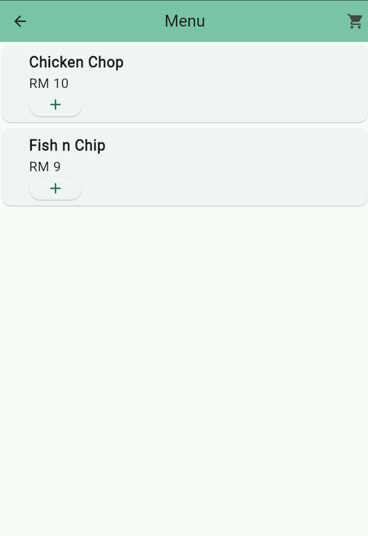

# Meranti Food Ordering Mobile Application

Developed a cross-platform homestay booking app using Flutter framework.
Architected the app using MVVM (Model-View-ViewModel) to ensure clean code separation, maintainability, and scalability.

